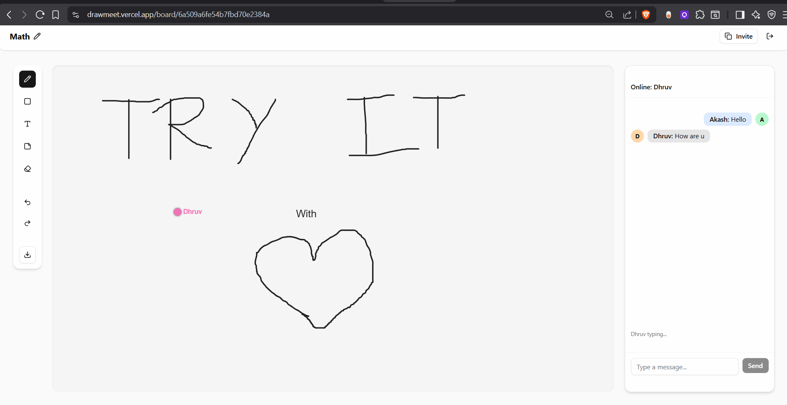
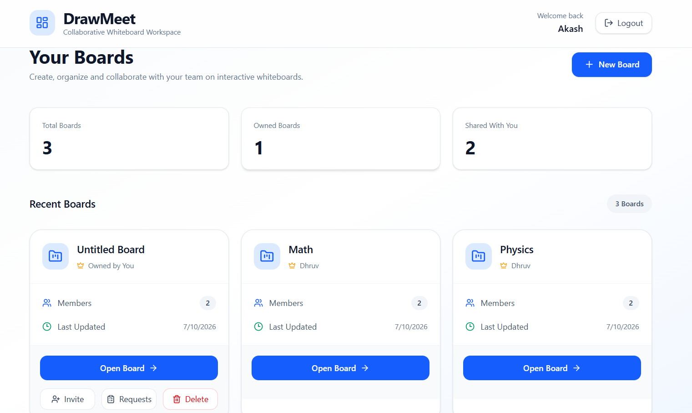

Try it: https://drawmeet.vercel.app/

Backend: https://drawmeet.onrender.com/

DrawMeet is a full-stack real-time collaborative whiteboard built using Next.js, Node.js, Express, Socket.IO, MongoDB, and an integrated Python FastAPI AI service. The application uses JWT-based authentication with protected REST APIs and role-based board permissions to ensure that only authorized users can access or manage collaborative workspaces. The backend follows a service-oriented architecture, separating routing, business logic, and data access to keep the codebase modular and maintainable. Real-time collaboration is powered by Socket.IO rooms, enabling multiple users to simultaneously draw, edit, chat, view live cursors, and see presence and typing indicators within the same board. Rather than storing the entire canvas state, every drawing operation—including shapes, arrows, text, sticky notes, erasing, undo, and redo—is persisted as an individual action in MongoDB, allowing new participants to reconstruct the board by replaying the event history. The platform also supports board ownership, member management, invitation by email, join request approval workflows, and board-specific authorization. On the frontend, React Konva is used for high-performance canvas rendering with an interactive interface that synchronizes real-time updates while maintaining persistent board history across sessions. The platform additionally integrates an AI-powered assistant built with FastAPI, LangChain, Google Gemini, and Pydantic, capable of generating editable diagrams from natural language prompts and producing intelligent summaries of the current board by reconstructing its latest state from the action history. The architecture is designed to be extensible toward production-scale optimizations such as LangGraph agent workflows, vector-based board context retrieval, event batching, canvas snapshots, and scalable AI-assisted collaboration.

